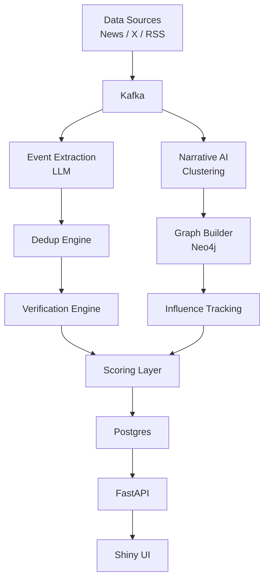

# Accord-AI

Accord AI is a production-shaped intelligence platform scaffold for monitoring geopolitical or policy compliance signals from live sources, extracting structured events, validating them across sources, scoring risk, and presenting the result through an API and Shiny dashboard.

## Architecture



## Repo layout

```text
accord-ai/
  api/
  dashboard/
  data/
  infra/
  notebooks/
  services/
  shared/
```

## Build order

1. Phase 1: run ingestion, extraction, and API with file-backed persistence.
2. Phase 2: add deduplication, verification, and scoring decisions.
3. Phase 3: turn on the Shiny dashboard against the API.
4. Phase 4: enable Kafka-backed streaming and Neo4j narrative graphing.

## Service overview

- `services/ingestion`: fetches real-source articles and publishes normalized raw documents.
- `services/extraction`: converts raw documents into structured events.
- `services/dedup`: merges near-duplicate events.
- `services/verification`: checks whether an event is supported by multiple sources.
- `services/scoring`: assigns analyst-facing priority and confidence.
- `services/narrative`: groups related events into narratives.
- `services/graph`: writes narrative/source/event relationships into Neo4j.
- `api`: exposes events, narratives, and health endpoints through FastAPI.
- `dashboard`: Shiny UI for map, timeline, and narrative filtering.

## MVP-first implementation notes

- The current scaffold uses a local JSONL store in `data/` so services can run before Postgres and Kafka are mandatory.
- Kafka and Neo4j are wired as optional infrastructure layers, not hard blockers.
- GDELT ingestion is included as the real data starting point; RSS can be layered in next.

## Quick start

1. Create a Python virtual environment and install the service dependencies.
2. Copy `.env.example` to `.env` and set your values.
3. Start infrastructure with Docker Compose if you want Kafka/Postgres/Neo4j.
4. Run the ingestion service to collect raw articles or seed sample data.
5. Run the local pipeline to produce structured events.
6. Start the API.
7. Launch the Shiny app from `dashboard/app.R`.

## Local commands

```bash
python3 -m venv .venv
source .venv/bin/activate
pip install -r requirements.txt
cp .env.example .env
python3 -m services.ingestion.producer --limit 10
python3 -m services.pipeline
python3 run_api.py
```

## Seeded local run

If you want to validate the app without network access, use the sample seed path:

```bash
python3 scripts/seed_sample_data.py
python3 -m services.pipeline
python3 run_api.py
```

Then open:

```text
http://localhost:8000/health
http://localhost:8000/events
```

## One-command Phase 1 run

```bash
bash scripts/run_phase1.sh 10
```

This runs ingestion, local extraction/scoring, and then starts the FastAPI server.

## Data contracts

### Raw document

```json
{
  "document_id": "doc_2026_04_21_0001",
  "source_type": "gdelt",
  "source_name": "GDELT",
  "title": "Headline",
  "url": "https://example.com/article",
  "published_at": "2026-04-21T09:10:00Z",
  "captured_at": "2026-04-21T09:11:00Z",
  "raw_text": "Normalized body text",
  "metadata": {
    "language": "en"
  }
}
```

### Structured event

```json
{
  "event_id": "evt_0001",
  "document_id": "doc_2026_04_21_0001",
  "source": "GDELT",
  "headline": "Headline",
  "summary": "Short extracted event summary",
  "narrative": "regional escalation",
  "entities": ["Iran", "Israel"],
  "locations": [
    {
      "name": "Tehran",
      "lat": 35.6892,
      "lon": 51.389
    }
  ],
  "occurred_at": "2026-04-21T09:10:00Z",
  "verification_status": "unverified",
  "score": 0.65,
  "priority": "p2"
}
```

## What is real vs scaffolded

- Real: GDELT fetch path, Kafka producer/consumer wiring, FastAPI app, Neo4j client, Docker Compose, Shiny shell.
- Scaffolded: extraction prompt logic, semantic dedup embeddings, cross-source verification heuristics, scoring policy.

## Phase 1 status

Phase 1 is now wired for local execution:

1. Ingestion writes normalized raw documents into `data/raw_documents.jsonl`.
2. Pipeline execution overwrites `data/events.jsonl` with the latest extracted and scored events.
3. FastAPI exposes those events through `/events` and `/narratives`.
4. The Shiny dashboard can read directly from the API once FastAPI is running.
